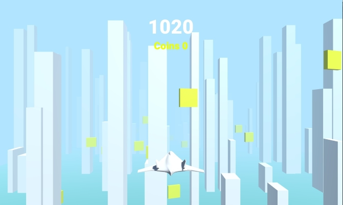

# Rogue Racer
  A simple 3D game built in Unity where you navigate a plane 
  through a series of obstacles and collect coins.

## Screenshots
  

## Downloads
  Download from the [Release Page](https://github.com/Fossilia/Rogue-Racer/releases). 
  Exported using Unity's built in project exporting tool, Currently only Windows version is available
